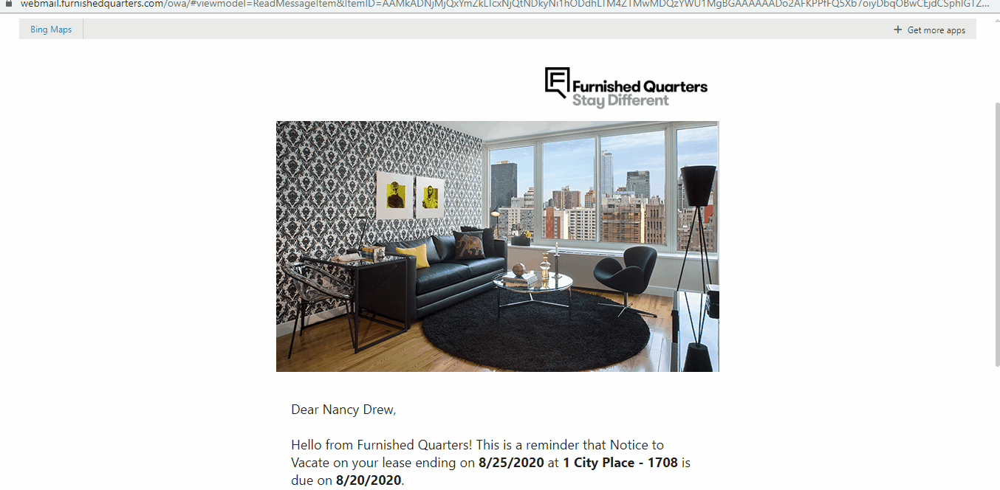
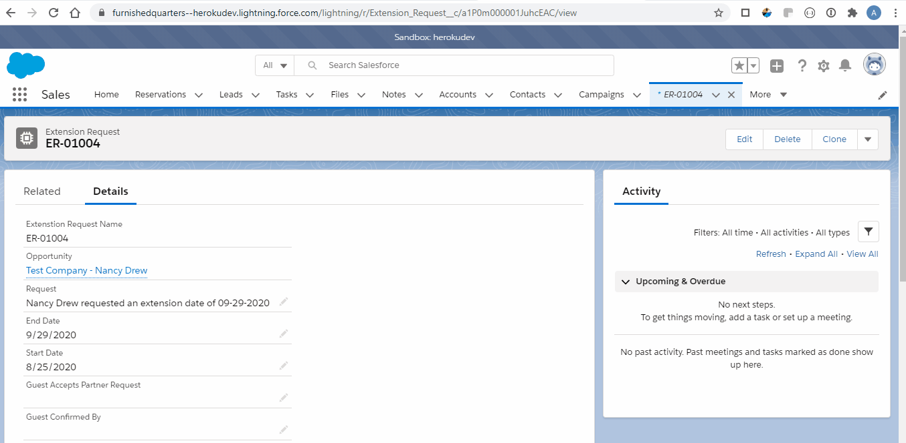
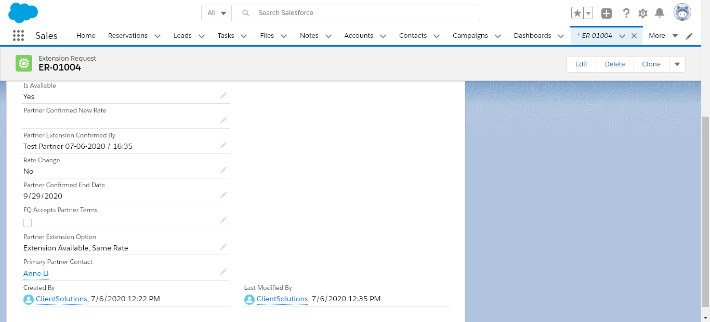
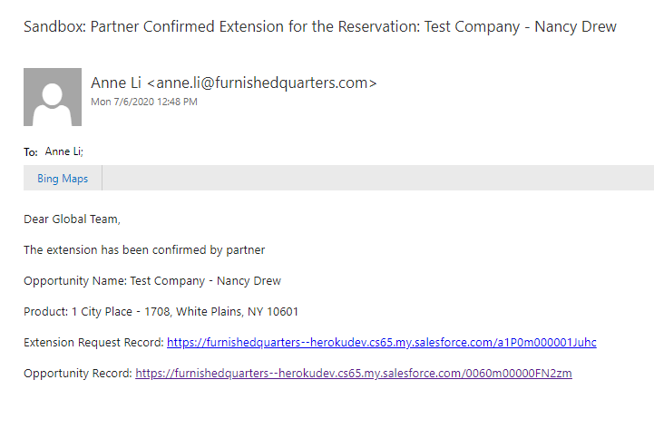
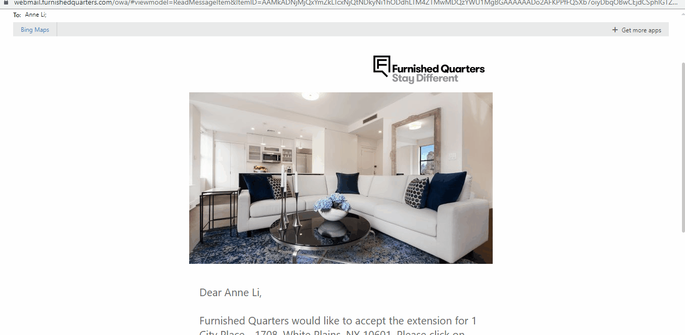

# Global Extension Process

<a href="https://furnishedquarters--herokudev.lightning.force.com/lightning/r/Opportunity/0060m00000FN2zmAAD/view" target="_blank">
  Test reservation used for this demo
  
</a>

 

#### Guest Requests Extension
Guest receives NTV Email and requests for extension

A new Extension Request record is created on Salesforce and the following fields are updated:

* **Request** - text field captures guest's full name and requested extension date
* **Opportunity** - lookup field to its associated Reservation
* **Primary Partner Contact**- lookup relates to the reservation's `Primary_Partner_Contact__c` field
    * This lookup field is needed for workflow rule `to email` recepient
* **Start Date** - date field set to current departure date
* **End Date** - date field set to requested date by guest

 

#### Partner Confirms Extension Availability
As soon as a new Extension Request record is created, an auto email is sent to partner

* Workflow Rule - <a href="https://furnishedquarters--herokudev.lightning.force.com/lightning/setup/WorkflowRules/page?address=%2F01Q0m00000077D4&nodeId=WorkflowRules" target="_blank">OOM Lease Extension - Partner</a>
* Email template - <a href="https://furnishedquarters--herokudev.lightning.force.com/lightning/setup/CommunicationTemplatesEmail/page?address=%2F00X0m000000z4nY" target="_blank">OOM Lease Extension - Partner</a>

The following fields on Extension Request record are updated in salesforce:

* **Partner Extension Option** - picklist that captures partner's selection from Client Solutions app
* **Is Available** - picklist with values `Yes` or `No` to confirm availability of extension
* **Rate Change** - picklist with values `Yes` or `No` to confirm any rate changes
* **Partner Confirmed New Rate** - currency field captures new rate if there's a rate change, otherwise field remains blank
* **Partner Extension Confirmed By** - text field captures partner's signature and date
* **Partner Confirmed End Date** - date field that captures confirmed end date
    * If date requested by guest is available, `Partner_Confirmed_End_Date__c` will be same as `End_Date__c`
    * If date requested by guest is not available, a different date will be set

 

#### FQ Approves Extension
When extension is confirmed by partner an auto email is sent to Global Leasing team

* Workflow Rule - <a href="https://furnishedquarters--herokudev.lightning.force.com/lightning/setup/WorkflowRules/page?address=%2F01Q0m00000077DY&nodeId=WorkflowRules" target="_blank">OOM Partner Confirmed Extension</a>
* Email Template - <a href="https://furnishedquarters--herokudev.lightning.force.com/lightning/setup/CommunicationTemplatesEmail/page?address=%2F00X0m0000012BNO" target="_blank">OOM Partner Confirmed Extension</a>

 

#### Notify Partner to Update Reservation
If extension proposal from partner is approved the `FQ Accepts Partner Terms` checkbox will be checked and an auto email is sent to partner displaying details of extension

* Workflow Rule - <a href="https://furnishedquarters--herokudev.lightning.force.com/lightning/setup/WorkflowRules/page?address=%2F01Q0m00000077GI&nodeId=WorkflowRules" target="_blank">OOM FQ Approved Extension</a>
* Email Template - <a href="https://furnishedquarters--herokudev.lightning.force.com/lightning/setup/CommunicationTemplatesEmail/page?address=%2F00X0m0000012BRB" target="_blank">OOM FQ Approved Extension</a>

 