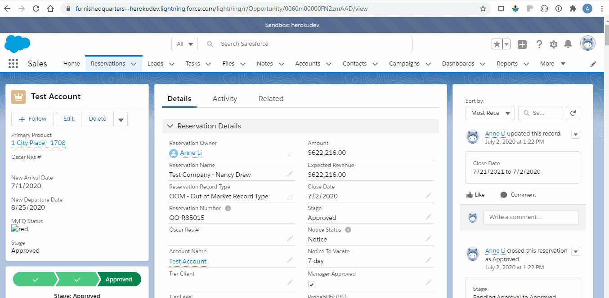

# Global Notice Process

<a href="https://furnishedquarters--herokudev.lightning.force.com/lightning/r/Opportunity/0060m00000FN2zmAAD/view" target="_blank">
  Test reservation used for this demo
  
</a>

 

#### Guest Confirms Departure
Guest receives NTV Email and confirms departure

After guest confirms departure, the following fields on Salesforce Reservation object will be updated:

* **Provider Notice Given** - checkbox is checked
* **Departure Confirmed** - checkbox is checked
* **Departure Confirmed By** - text field captures guest's signature and date
* **Notice Contact Partner By** - date field is set to the date guest confirmed their departure
* **Notice Status** - picklist changes to notice

 

#### Partner Confirms Guest's Departure
An auto email is sent to the reservation's `Primary_Partner_Contact__c` to confirm guest's departure:

* Workflow Rule: <a href="https://furnishedquarters--herokudev.lightning.force.com/lightning/setup/WorkflowRules/page?address=%2F01Q0m000000778n&nodeId=WorkflowRules" target="_blank">NTV Partner - Departure Confirmation</a>
* Email Template: <a href="https://furnishedquarters--herokudev.lightning.force.com/lightning/setup/CommunicationTemplatesEmail/page?address=%2F00X0m000000z4nd" target="_blank">OOM Departure Confirmed - Partner</a>

If partner is unable to confirm guest's departure at this time, an option `Unable to Confirm`is available which brings up an email template pre-filled to send to `globalnotices@furnishedquarters.com`

After partner confirms guest's departure the following fields will be updated on Reservation object:

* **Partner NTV Confirmed** - checkbox is checked
* **Partner NTV Confirmed By** - text field captures partner's signature and date

 

#### Notify Global Team when Partner Confirmed Guest's Departure
An auto email is sent to Global Lease team notifying the partner has confirmed guest's departure

* Workflow Rule - <a href="https://furnishedquarters--herokudev.lightning.force.com/lightning/setup/WorkflowRules/page?address=%2F01Q0m0000007797&nodeId=WorkflowRules" target="_blank">NTV Provider Notice Confirmed</a>
* Email Template - <a href="https://furnishedquarters--herokudev.lightning.force.com/lightning/setup/CommunicationTemplatesEmail/page?address=%2F00X0m0000012BKK" target="_blank">Provider Notice Confirmed</a>

