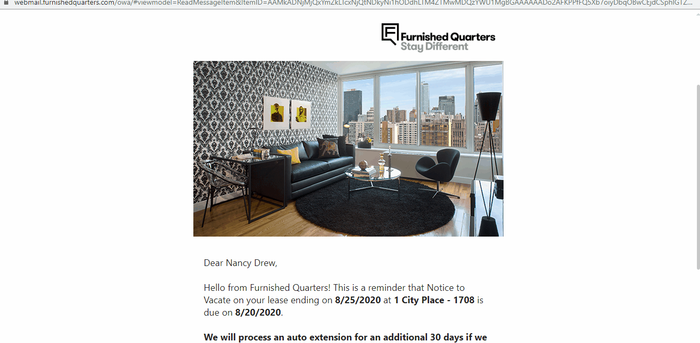
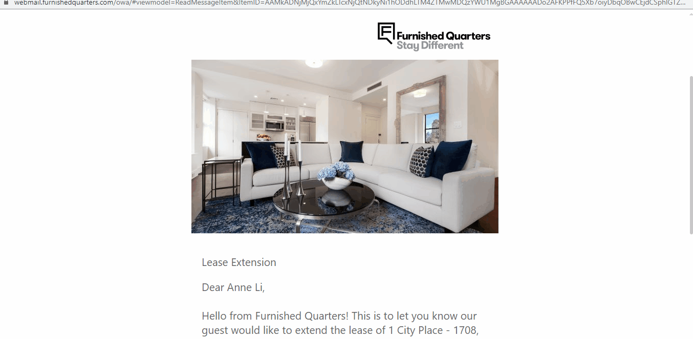

# Tech Guide

<br>

## Routes
###### `./config/routes.rb`
```rb
# Notice Routes
# departure routes
get "/notices/confirm-departure", to: "notices#confirmdeparture"
post "/notices/submitconfirmation", to: "notices#submitconfirmation"
get "/notices/departure-confirmed", to: "notices#departureconfirmed"
get "/notices/departure-confirmation-error", to: "notices#departureerror"
get "/notices/partner-confirm-departure", to: "notices#partnerconfirmdeparture"
post "/notices/partner-confirms-departure", to: "notices#partner_confirms_departure"

# extension routes
get "/notices/extend", to: "notices#extend"
post "/notices/submitextension", to: "notices#submitextension"
get "/notices/extension-confirmed", to: "notices#extensionconfirmed"
get "/notices/extension-error", to: "notices#extensionerror"
get "/notices/partner-confirm-extension", to: "notices#partnerconfirmextension"
post "/notices/partner-confirms-extension", to: "notices#partner_confirms_extension"
get "/notices/confirmation-success", to: "notices#confirmationsuccess" 
get "/notices/already-confirmed", to: "notices#alreadyconfirmed"
get "/notices/fq-confirmation-partner", to: "notices#fqconfirmationpartner"
```

<br>

## Handling Invalid Url
* Redirects to `/notices/404` page if `resid` or `extid` is missing or invalid
* See `notices_controller#is_valid_id` helper method for validation details


<br>
<br>

## Global Notice Process
* Guest receives NTV email and confirms departure
* Clicking on `Confirm Departure` link will redirect them to `/notices/confirm-departure` path



###### `./app/controllers/notices_controller.rb`
```rb

class NoticesController < ApplicationController
def confirmdeparture
    if is_valid_id(params[:resid]) == false
        redirect_to "/notices/404"
        return
    end
    
    @departure = salesforce.query("
        SELECT Id, Notice_Due__c, RecordTypeId, Departure_Confirmed__c, Departure_Date__c 
        FROM Opportunity 
        WHERE Id = '"+params[:resid]+"'"
    )
    
    if @departure.first.nil? 
        redirect_to "/notices/404"
        return
    end
    
    @departure.each do |item| 
        if item.Departure_Confirmed__c == true
            redirect_to handle_path(notices_departure_confirmation_error_path, item.RecordTypeId)
        end
    end    
end
end
```

* Renders `./app/views/notices/confirmdeparture.html.erb` template
* Checks if query string params are valid
* Checks if departure is already confirmed
* If record is found, guest will be redirected to `Already Confirmed` page
* When guest submits form, POST request is made to `/notices/submitconfirmation` route

<br>

###### `./app/controllers/notices_controller.rb`
```rb
class NoticesController < ApplicationController
    # ...

    def submitconfirmation
        # ...
            # ...
            if params[:recordtypeid] == '012300000000Y6vAAE'
                @confirmdeparture = salesforce.update('Opportunity', 
                    Id: params[:res], 
                    Notice_Contact_Partner_By__c: Time.now.to_date, 
                    Provider_Notice_Given__c: true, 
                    Departure_Confirmed_By__c: confirmed_by(params[:fullname]), 
                    Notice_Status__c: "Notice",
                    ntv_notice__c: 1, 
                    Departure_Confirmed__c: 1
                )
            else 
                # ...
            end

            if @confirmdeparture
                # Display the success page
                redirect_to notices_departure_confirmed_path
            else
                # If the reservation was already confirmed, display the error page
                redirect_to handle_path(notices_departure_submission_error_path, params[:recordtypeid])
            end
        end
    end
end
```

* If the reservation's `RecordTypeId` is `OOM - Out of Market` the above fields will be updated on Salesforce
* Guest is redirected to `/notices/departure-confirmed` path after departure is confirmed
* If guest tries to refresh the page or re-submit the form, they will be redirected to `/notices/departure-confirmation-error` path

<br>

An auto email will be sent to the reservation's `Primary_Partner_Contact__c` if the following conditions are met:

* `Partner_NTV_Confirmed__c` is false (checkbox is unchecked)
* `Departure_Confirmed__c` is true (checkbox is checked)
* `Partner_Type__c` picklist is either:
    * Corporate Housing
    * Hotel
    * Property Direct Furnished


* Workflow Rule - <a href="https://furnishedquarters--herokudev.lightning.force.com/lightning/setup/WorkflowRules/page?address=%2F01Q0m0000007797&nodeId=WorkflowRules" target="_blank">NTV Provider Notice Confirmed</a>
* Email Template - <a href="https://furnishedquarters--herokudev.lightning.force.com/lightning/setup/CommunicationTemplatesEmail/page?address=%2F00X0m0000012BKK" target="_blank">Provider Notice Confirmed</a>

<br>

Partner will recieve and email which redirects them to `/notices/partner-confirm-departure` path


###### `./app/controllers/notices_controller.rb`
```rb
class NoticesController < ApplicationController
    # ...
    def partner_confirms_departure
        # ...
        if params[:ntvconfirmed] == "true" || @reservation.first.Partner_NTV_Confirmed__c == true
            # ...
        else
            if params[:recordtypeid] == '012300000000Y6vAAE'            # of record type OOM
                @confirmation = salesforce.update('Opportunity', 
                    Id: params[:res], 
                    Partner_NTV_Confirmed__c: true, 
                    Partner_NTV_Confirmed_By__c: confirmed_by(params[:fullname])
                )
            end
            
            if @confirmation 
                redirect_to handle_path(notices_confirmation_success_path, params[:recordtypeid])
            else 
                redirect_to handle_path(notices_already_confirmed_path, params[:recordtypeid])
            end
        end
    end
end
```

* When partner submits form, a POST request is made to `/notices/partner-confirm-departure` route
* The above fields are updated on the Reservation record
* Partner is redirected to `/notices/confirmation-success` path
* If partner refreshes the page or tries to re-submit the form they will be redirected to `/notices/already-confirmed` path

<br>

When `Partner_NTV_Confirmed__c` is set to `true` it will trigger a workflow and sends Global Leasing team an email notifying partner has confirmed guest's departure

* Workflow Rule: <a href="https://furnishedquarters--herokudev.lightning.force.com/lightning/setup/WorkflowRules/page?address=%2F01Q0m000000778n&nodeId=WorkflowRules" target="_blank">NTV Partner - Departure Confirmation</a>
* Email Template: <a href="https://furnishedquarters--herokudev.lightning.force.com/lightning/setup/CommunicationTemplatesEmail/page?address=%2F00X0m000000z4nd" target="_blank">OOM Departure Confirmed - Partner</a>


<br>
<br>

## Global Extension Process
Guest receives NTV email and requests for extension


* GET request is made to `/notices/extend` path
* When guest submits form a POST request is made to `/notices/submitextension` path

<br>

###### `./app/controllers/notices_controller.rb`
```rb
# ...
def submitextension
    # ...

    if extension && extension.empty? == false 
        # ...
    elsif reservation.Departure_Confirmed__c == true 
        # ...
    elsif params[:monthtomonth] == " true "
        # check if month-to-month is true, meaning an extension may be submitted
        extension_params = {
            Opportunity__c: params[:res],
            Request__c: params[:fullname] + " requested an extension date of " + 
                format_date(params[:extensiondate]),
            Start_Date__c:  params[:departuredate].to_date,
            End_Date__c: params[:extensiondate].to_date,
            Primary_Partner_Contact__c: params[:primarypartnerid]
        }

        # @addnote will be false in the case that extension request was not created. 
        # In this case forward to an error page
        @addnote = salesforce.create('Extension_Request__c', extension_params)

        if @addnote
            redirect_to notices_extension_confirmed_path
        else
            redirect_to handle_path(notices_extension_submission_error_path, reservation.RecordTypeId)
        end
    else
        redirect_to handle_path(notices_extension_departure_confirmed_path, reservation.RecordTypeId)
    end
end
```

* A new `Extension_Request__c` record is created on salesforce, with the above fields updated
* Guest will be redirected to `/notices/extension-confirmed` path
* If guest already submitted an extension and tries to re-submit it will redirect guest to `/notices/extension-error` path
* If guest refreshes the page or clicks on `I Wish to Extend` button from NTV email, it will also redirect guest to `/notices/extension-error` path
* Note: the contact email is determined from query string of `oom=true` using `globalnotices@furnishedquarters.com` for OOM record types.
    * Check out the `notices_controller#handle_path` helper method for more details

<br>

As soon as a new `Extension_Request__c` record is created a workflow rule is triggered and an an auto email is sent to Partner

* Workflow Rule - <a href="https://furnishedquarters--herokudev.lightning.force.com/lightning/setup/WorkflowRules/page?address=%2F01Q0m00000077D4&nodeId=WorkflowRules" target="_blank">OOM Lease Extension - Partner</a>
* Email template - <a href="https://furnishedquarters--herokudev.lightning.force.com/lightning/setup/CommunicationTemplatesEmail/page?address=%2F00X0m000000z4nY" target="_blank">OOM Lease Extension - Partner</a>




* Partner can choose from dropdown menu of options to confirm if extension is available
    * Default is set to `Extension Available, Same Rate`
    * If partner chooses either option with `Rate Change` and/or `Different Date`
        * A required input field(s) will appear to capture the new rate and/or new date
    
* A POST request is made to `/notices/partner-confirms-extension` route when partner submits form

<br>

###### `./app/controllers/notices_controller.rb`
```rb
# ...
def partner_confirms_extension
    # ...
    if #
        # checks if url params are valid
    elsif # ...
        # checks if extension is already confirmed
    else 
        extension_params = {
            Id: params[:extid],
            Partner_Extension_Option__c: params[:extension],
            Partner_Extension_Confirmed_By__c: confirmed_by(params[:fullname]),
            Is_Available__c: 'Yes',
            Rate_Change__c: 'No',
            Partner_Confirmed_End_Date__c: @extension.End_Date__c
        }
        
        if params[:extension] == "Extension Available, Same Rate"
            @request = salesforce.update('Extension_Request__c', extension_params)
        elsif params[:extension] == "Extension Available, Rate Change"
            extension_params[:Rate_Change__c] = 'Yes'
            extension_params[:Partner_Confirmed_New_Rate__c] = params[:newrate].to_f
            @request = salesforce.update('Extension_Request__c', extension_params)
        elsif params[:extension] == "Extension Available, Different Date"
            # date must be formated as yyyy-mm-dd to save to salesforce
            extension_params[:Partner_Confirmed_End_Date__c] = format_date_sf(params[:newdate])
            @request = salesforce.update('Extension_Request__c', extension_params)
        elsif params[:extension] == "Extension Available, Rate Change, Different Date"
            extension_params[:Rate_Change__c] = 'Yes'
            extension_params[:Partner_Confirmed_New_Rate__c] = params[:newrate].to_f
            extension_params[:Partner_Confirmed_End_Date__c] = format_date_sf(params[:newdate])
            @request = salesforce.update('Extension_Request__c', extension_params)
        elsif params[:extension] == "Extension Not Available"
            extension_params[:Is_Available__c] = 'No'
            extension_params[:Rate_Change__c] = nil
            extension_params[:Partner_Confirmed_End_Date__c] = nil
            @request = salesforce.update('Extension_Request__c', extension_params)
        end
        
        redirect_to handle_path(notices_confirmation_success_path, @extension.Opportunity__r.RecordTypeId)
    end
end
```

* The Extension Request record fields will be updated depending on which option Partner chooses
* Partner will be redirected to `/notices/confirmation-success` path after confirming extension availability
* If partner tries to refresh the page or re-submit the form, they will be redirected to `/notices/already-confirmed` path

<br>

Once `Partner_Extension_Confirmed_By__c` field is captured, a workflow will be triggered and an auto email will be sent to Global Leasing team to either accept or reject partner terms

* Workflow Rule - <a href="https://furnishedquarters--herokudev.lightning.force.com/lightning/setup/WorkflowRules/page?address=%2F01Q0m00000077DY&nodeId=WorkflowRules" target="_blank">OOM Partner Confirmed Extension</a>
* Email Template - <a href="https://furnishedquarters--herokudev.lightning.force.com/lightning/setup/CommunicationTemplatesEmail/page?address=%2F00X0m0000012BNO" target="_blank">OOM Partner Confirmed Extension</a>


<br>

If Partner terms are accepted, the `FQ_Accepts_Partner_Terms__c` checkbox is checked off in Salesforce and an auto email is sent to partner displaying the details of extension request

* Workflow Rule - <a href="https://furnishedquarters--herokudev.lightning.force.com/lightning/setup/WorkflowRules/page?address=%2F01Q0m00000077GI&nodeId=WorkflowRules" target="_blank">OOM FQ Approved Extension</a>
* Email Template - <a href="https://furnishedquarters--herokudev.lightning.force.com/lightning/setup/CommunicationTemplatesEmail/page?address=%2F00X0m0000012BRB" target="_blank">OOM FQ Approved Extension</a>


* Partner is redirected to `/notices/fq-confirmation-partner` route